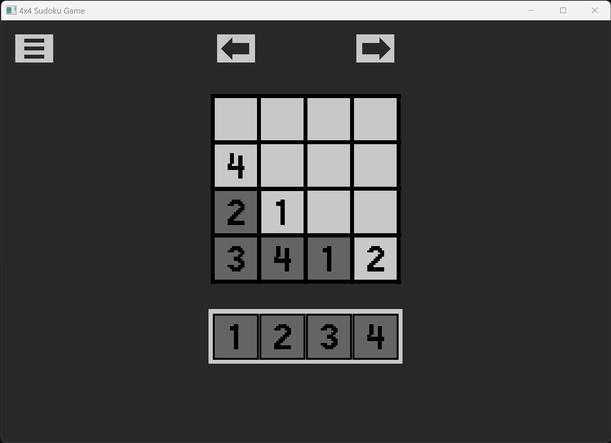

# 4x4 Sudoku Puzzles

**CURRENTLY A WORK-IN-PROGRESS**

This is a simple puzzle game containing a collection of 4 x 4 Sudoku puzzles. Sudoku puzzles are a common type of grid puzzle, information about them can be found on Wikipedia.

## Gameplay

Use the mouse to drag tiles onto the grid so that each row, column, and 2 x 2 quadrant contains the numbers 1,2,3,4 in some order. Levels do not save on exit of the game.

## Build Instructions

This is a Zig project that natively calls raylib code written in C. (More on dependencies below.)

Since the Zig compiler comes with its own build system and is also a C compiler, the project can be built and run with the command

`zig build run`

A release build can be created with the following command.

`zig build -Doptimize=ReleaseFast`

The project was built with the Zig 0.11.0 compiler on Windows 11, available from the [download page](https://ziglang.org/download/) on `ziglang.org`. Compilation of the game on other operating systems has not been tested.

## Dependencies

The project is written in Zig and uses the raylib library, [specifically v5.0](https://github.com/raysan5/raylib/releases/tag/5.0) (commit number ae50bfa). We included the necessary source files from raylib directly in our project (under the `Raylib5` directory), but deleted unnecessary parts of the library (like its numerous examples). We also combined the `build.zig` file there into the build file for the project, simplifying it for Zig compiler 0.11.0.

Raylib is created by Ramon Santamaria (GitHub handle [@raysan5](https://github.com/raysan5)) and is available on GitHub [here](https://github.com/raysan5/raylib). See the link above for Raylib's full license / copywrite details.

## Development

The entire development of this app (basically) was streamed on Twitch and recordings were uploaded to YouTube at:

https://www.twitch.tv/10aded

https://www.youtube.com/@10aded
