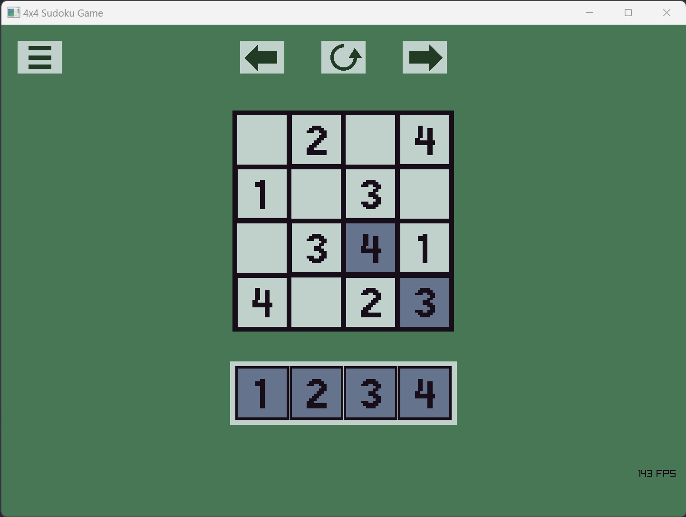

# 4x4 Sudoku Puzzles

This is a simple puzzle game containing a collection of 4x4 Sudoku puzzles. Sudoku puzzles are a common type of grid puzzle; information about them can be found on [Wikipedia](https://en.wikipedia.org/wiki/Sudoku).

## Gameplay

Use the mouse to drag tiles onto the grid so that each row, column, and 2x2 quadrant contains the numbers 1,2,3,4 in some order. Levels do not save when the game is quit.

## Build Instructions

This is a Zig project that natively calls raylib code (which is written in C). (More on dependencies below.)

Since the Zig compiler comes with its own build system and is also a C compiler, the project can be built and run with the command

`zig build run`

A release build can be created with the following command.

`zig build -Doptimize=ReleaseFast`

Building the project requires the compiler version to be 0.14.0 at minimum. The project has been tested with the Zig 0.14.0 compiler on Windows 11, available from the [download page](https://ziglang.org/download/) on `ziglang.org`. Compilation of the game on other operating systems has not been tested.

## Dependencies

The project is written in Zig and uses the raylib library, [specifically commit number `46cd07d`](https://github.com/raysan5/raylib). We included the necessary source files from raylib directly in our project (under the `deps/raylib_5_5_plus` directory), but deleted unnecessary parts of the library (like its numerous examples). 

Raylib is created by Ramon Santamaria (GitHub handle [@raysan5](https://github.com/raysan5)) and is available on GitHub [here](https://github.com/raysan5/raylib). See the link above for Raylib's full license / copywrite details.

## Development

The entire development of this app (basically) was streamed on Twitch and recordings were uploaded to YouTube at:

https://www.twitch.tv/10aded

https://www.youtube.com/@10aded

The project was originally built with the Zig `0.11.0` compiler, and was updated to work with 0.14.0 of the compiler on 22 March 2025.

The project was originally built using Raylib 5, but was updated to use Raylib 5.5+ (commit number `46cd07d`).
